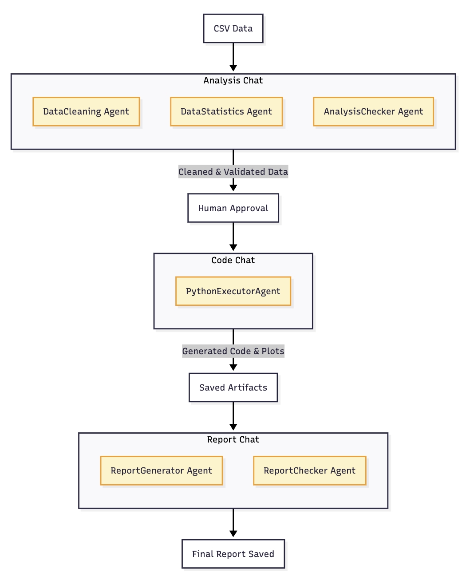
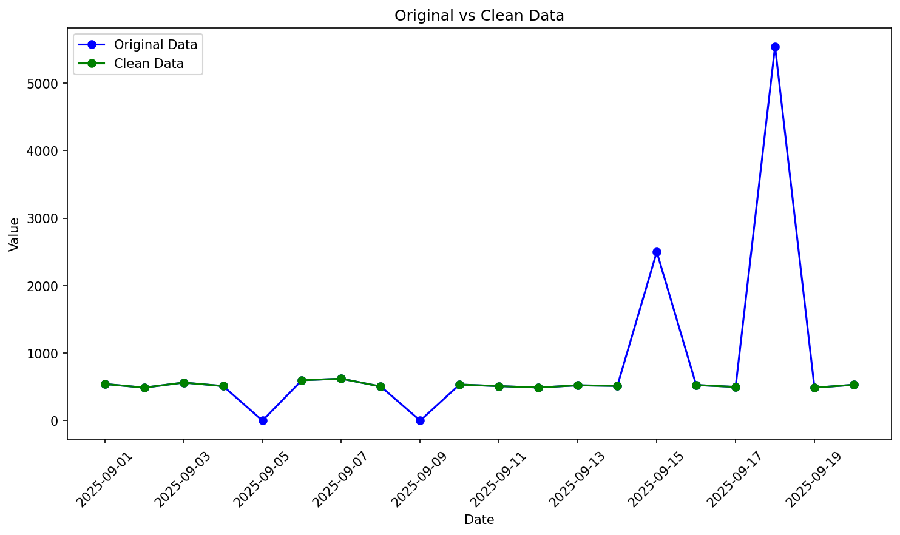

# AgentQuant: Agentic Data Analysis

An end-to-end AI-powered data analysis and reporting workflow using Python and Semantic Kernel. This project integrates multiple specialized AI agents to automate the processes of data cleaning, statistical analysis, code generation, visualization, and report generation.

## Architecture



The system uses a multi-agent architecture with three specialized group chats:

1. **Analysis Chat** - Data cleaning, statistics computation, and validation
2. **Code Chat** - Python visualization code generation
3. **Report Chat** - Comprehensive report generation and quality assurance

## Features

- **Automated Data Cleaning**: Identifies and removes outliers using the IQR method
- **Statistical Analysis**: Computes descriptive statistics (mean, median, std, min, max, quartiles)
- **Validation Pipeline**: Multi-step validation ensures data integrity and consistency
- **Dynamic Visualization**: Generates Python code for data visualization automatically
- **Report Generation**: Creates comprehensive markdown reports with all analysis results
- **Human-in-the-Loop**: Requires human approval before proceeding with visualization
- **Retry Logic**: Automatic code retry mechanism for failed executions

## Project Structure

```
AgentQuant-agentic-data-analysis/
├── final.py                 # Main workflow script
├── image.png                # Architecture diagram
├── .env                     # Environment variables (API keys)
├── README.md                # This file
├── data/                    # Input CSV data files
│   ├── data-Marketing-1.csv
│   ├── data-Sensor-1.csv
│   ├── data-Sensor-2.csv
│   ├── data-Sensor-3.csv
│   ├── data-Stock-1.csv
│   └── data-Stock-2.csv
├── specs/                   # Agent instruction specifications
│   ├── Data_Quality_Instructions.txt
│   └── Report_Instructions.txt
├── logs/                    # Agent interaction logs
│   └── agent_chat.log
└── artifacts/               # Generated outputs
    ├── cleaned_data.txt
    ├── visualization_script.py
    ├── data_visualization.png
    └── final_report.md
```

## Prerequisites

- Python 3.11+
- Azure OpenAI API access

## Installation

1. **Clone the repository**
   ```bash
   git clone https://github.com/yourusername/AgentQuant-agentic-data-analysis.git
   cd AgentQuant-agentic-data-analysis
   ```

2. **Install dependencies**
   ```bash
   pip install semantic-kernel python-dotenv pandas matplotlib seaborn
   ```

3. **Set up environment variables**

   Create a `.env` file in the project root:
   ```env
   AZURE_OPENAI_KEY=your_azure_openai_api_key
   URL=https://your-endpoint.openai.azure.com/openai/deployments/your-deployment/chat/completions?api-version=2024-12-01-preview
   API_VERSION=2024-12-01-preview
   ```

4. **Create required directories**
   ```bash
   mkdir -p artifacts logs
   ```

## Usage

Run the main workflow:

```bash
python final.py
```

The workflow will:
1. Prompt you to select a CSV file from the `data/` directory
2. Run the analysis chat (cleaning → statistics → validation)
3. Ask for human approval of the cleaned data
4. Generate visualization code and execute it
5. Generate a comprehensive report
6. Save all artifacts to the `artifacts/` directory

## Agents

### Analysis Chat Agents

| Agent | Temperature | Purpose |
|-------|-------------|---------|
| **DataCleaning** | 0.3 | Identifies and removes outliers using IQR method |
| **DataStatistics** | 0.1 | Computes descriptive statistics on cleaned data |
| **AnalysisChecker** | 0.0 | Validates data cleaning and statistics accuracy |

### Code Chat Agent

| Agent | Temperature | Purpose |
|-------|-------------|---------|
| **PythonExecutorAgent** | 0.0 | Generates Python visualization code |

### Report Chat Agents

| Agent | Temperature | Purpose |
|-------|-------------|---------|
| **ReportGenerator** | 0.5 | Creates comprehensive markdown reports |
| **ReportChecker** | 0.0 | Validates report completeness and accuracy |

## Workflow Stages

### Stage 1: Data Loading
- User selects a CSV file from available options
- Data is loaded and converted to a string format for agent processing

### Stage 2: Analysis Chat
- **DataCleaning Agent**: Parses data, detects outliers using IQR method, removes invalid values
- **DataStatistics Agent**: Computes count, mean, median, std, min, max, Q1, Q3
- **AnalysisChecker Agent**: Validates cleaning and statistics, outputs "Approved" or detailed errors

### Stage 3: Human Approval
- User reviews analysis results
- Workflow continues only with explicit approval

### Stage 4: Code Generation & Execution
- **PythonExecutorAgent**: Generates matplotlib code for "Original vs Clean Data" visualization
- Code is executed with retry logic (up to 3 attempts)
- Failed executions trigger automatic code fixes

### Stage 5: Report Generation
- **ReportGenerator Agent**: Compiles all results into a structured markdown report
- **ReportChecker Agent**: Validates report completeness and formatting
- Final report saved to `artifacts/final_report.md`

## Output Examples

### Generated Visualization


### Sample Report Structure
```markdown
# Data Analysis Report
**Data Date:** 2025-09-20

## Overview
[Summary of the analysis process]

## 1. Data Cleaning
- Approach
- Detected Outliers (removed)
- Cleaned Data

## 2. Descriptive Statistics
| Statistic | Value |
|-----------|-------|
| Count     | 16    |
| Mean      | 530.75|
| ...       | ...   |

## 3. Validation Summary
## 4. Data Visualization
## 5. Conclusions

### Agent Workflow Summary
| Step | Agent | Action | Status |
|------|-------|--------|--------|
| ...  | ...   | ...    | ...    |
```

## Termination Strategy

The workflow uses a custom `ApprovalTerminationStrategy` that:
- Monitors agent outputs for the word "Approved"
- Terminates the group chat when approval is detected
- Limits iterations to prevent infinite loops (10 for analysis/report, 5 for code)

## Error Handling

- **CSV Loading**: Graceful handling of missing or malformed files
- **Code Execution**: Retry mechanism with error feedback to the agent
- **File I/O**: Exception handling for all file operations
- **Logging**: All agent interactions logged to `logs/agent_chat.log`

## Configuration

### Agent Temperature Settings
- **0.0** - Deterministic tasks (code generation, validation)
- **0.1** - Statistical calculations (must be accurate)
- **0.3** - Data cleaning (some flexibility in approach)
- **0.5** - Report writing (creative but structured)

### Customization
- Modify agent prompts in `AGENT_CONFIG` dictionary
- Adjust termination iterations in group chat setup
- Update spec files in `specs/` for custom instructions

## Troubleshooting

| Issue | Solution |
|-------|----------|
| `ModuleNotFoundError` | Run `pip install semantic-kernel` |
| `ServiceInitializationError` | Check `.env` file has correct URL and API key |
| Code execution fails | Check `artifacts/visualization_script.py` for errors |
| Empty report | Ensure ReportGenerator output is captured (not ReportChecker) |

## License

This project is for educational purposes as part of the Udacity Nanodegree program.

## Acknowledgments

- [Semantic Kernel](https://github.com/microsoft/semantic-kernel) - Microsoft's AI orchestration framework
- [Azure OpenAI](https://azure.microsoft.com/en-us/products/ai-services/openai-service) - LLM API provider
